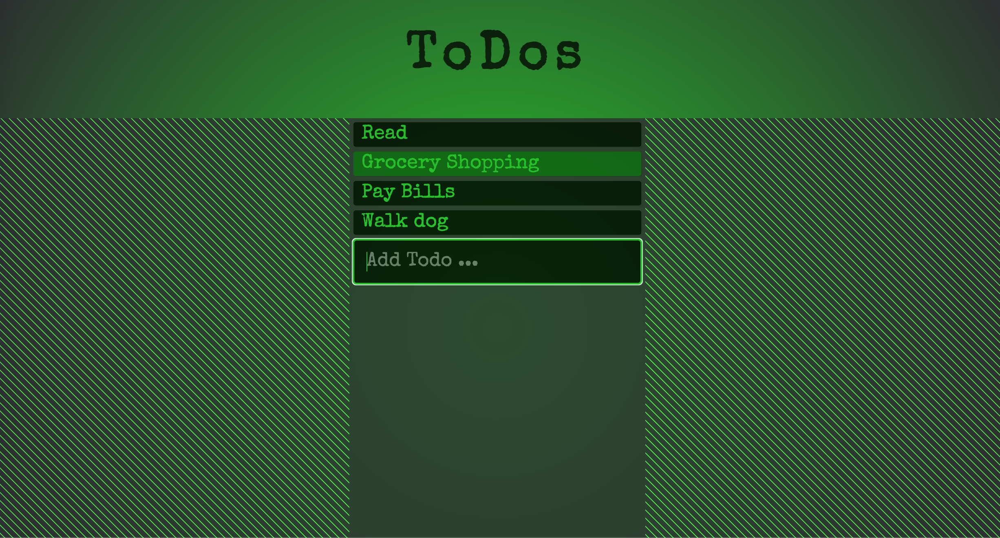

# ToDo_List

This assigment was completed for the MIT xPro Fullstack Development with MERN certificate program. Provided with starter code for the React ToDo List application, we were asked to add styling to the to-do list.

<h2>To run:</h2>
Everything required to run this project is in this repository. You're welcome to fork and clone this repository, or you can just navigate to: https://ael-s.github.io/ToDo_List/. Click on the to-do items to make them disappear once you're done with the task. Type new tasks into the text field at the bottom. 

<h2>Roadmap of future improvements:</h2>
I will return to this code at a later date to add a way for the to-do list items to be crossed off the first time they are pressed, and then will disappear if pressed once more. *Note: this was designed to work best on computer, I will eventually work on updating it to be easier to use on mobile devices*

<h2>Support:</h2>
Feel free to message me on LinkedIn (https://www.linkedin.com/in/anna-stegmann-77825b136/) if you have any questions.

<h2>License</h2>
MIT License Copyright (c) 2022 Anna Stegmann
Permission is hereby granted, free of charge, to any person obtaining a copy of this software and associated documentation files (the "Software"), to deal in the Software without restriction, including without limitation the rights to use, copy, modify, merge, publish, distribute, sublicense, and/or sell copies of the Software, and to permit persons to whom the Software is furnished to do so, subject to the following conditions:

The above copyright notice and this permission notice shall be included in all copies or substantial portions of the Software.

THE SOFTWARE IS PROVIDED "AS IS", WITHOUT WARRANTY OF ANY KIND, EXPRESS OR IMPLIED, INCLUDING BUT NOT LIMITED TO THE WARRANTIES OF MERCHANTABILITY, FITNESS FOR A PARTICULAR PURPOSE AND NONINFRINGEMENT. IN NO EVENT SHALL THE AUTHORS OR COPYRIGHT HOLDERS BE LIABLE FOR ANY CLAIM, DAMAGES OR OTHER LIABILITY, WHETHER IN AN ACTION OF CONTRACT, TORT OR OTHERWISE, ARISING FROM, OUT OF OR IN CONNECTION WITH THE SOFTWARE OR THE USE OR OTHER DEALINGS IN THE SOFTWARE.
